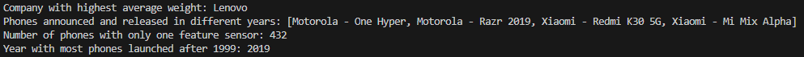

# Alternative Language Project

Submitted by: **Ethan Fleming**

This program: **Reads in a CSV file that has statistics for 1,000 cell phones. Cleans the data. Creates Cell objects for each line, with additional methods for printing information, calculating statistics, listing unique values, ability to add an object, and ability to delete an object. Includes checks for manual testing and automated tests via JUnit.**

## Report
#### Which programming language and version did you pick?

Java 21

#### Why did you pick this programming language?

I chose Java because I haven't worked in it since 2009, it's still very prevalent in the modern industry, and I knew it had access to HashMap.

#### How your programming language chosen handles: object-oriented programming, file ingestion, conditional statements, assignment statements, loops, subprograms (functions/methods), unit testing and exception handling. If one or more of these are not supported by your programming language, indicate it as so. 

##### Object-Oriented Programming

Java is fundamentally object-oriented, which means it uses classes as templates to build objects. These objects encapsulate data and operations. Java fully embraces core principles like inheritance, polymorphism, encapsulation, and abstraction.

##### File Ingestion

Handling files in Java is pretty comprehensive. It provides several classes such as File, BufferedReader, and Scanner that help read and write files easily, whether they are text or binary. The java.nio.file.Files class is especially handy for more complex file operations, offering a modern approach to file handling.

##### Conditional Statements

In Java, making decisions is straightforward with if-else statements for basic conditions, and switch statements for cases where it needs to perform different actions based on multiple possible values of a variable. This setup helps avoid cluttering the code with too many if-else blocks.

##### Assignment Statements

Java makes it easy to work with variable assignments. Using = for straightforward assignments and operators like += and *= for modifying values directly makes the code clean and easy to manage.

##### Loops

For repeating tasks, Java is covered with several types of loops. The for loop is great when I know how many times I need to repeat something. The while and do-while loops are perfect when the number of repetitions depends on something dynamic, and the for-each loop is fantastic for going through elements in arrays and collections.

##### Subprograms

Java organizes functionality with methods. I can write a chunk of code once in a method and reuse it by calling the method whenever needed. These methods can also take parameters, making them very flexible.

##### Unit Testing

Testing in Java is streamlined with JUnit, a framework that makes it easy to write and run tests. It lets me annotate methods to specify which ones are tests, and it takes care of the rest, helping ensure my code works as expected.

##### Exception Handling

Dealing with errors in Java is clear and manageable thanks to its exception handling model. Using try-catch blocks, it can handle exceptions and errors, ensuring the program doesn't crash and can recover or inform the user appropriately. The finally block is super useful for cleaning up afterward, no matter what happens.

#### List out 3 libraries you used from your programming language (if applicable) and explain what they are, why you chose them and what you used them for.

##### java.util.regex

This library is essential for handling regular expressions in Java, which are used for defining patterns that help in searching, editing, or manipulating strings. The regex library gave me access to the much needed Matcher and Pattern libraries. These were necessary to be able to properly parse and clean the input strings where necessary. While not so useful for checking the oem column, they were immensely useful for columns such as launch_announced.

##### java.nio.file

This is part of Java's New I/O (NIO) library that provides comprehensive support for file and file system manipulation. It is designed to provide more performant I/O operations than the older java.io library. The file library was necessary to be able to create the JUnit tests.

##### org.junit

This library is a popular Java library used for writing and running repeatable tests in a Java application, providing annotations and assertions to help structure tests and verify conditions during execution. It is essential for implementing unit testing in Java projects, allowing developers to efficiently identify bugs and ensure that their code meets its design and behaves as intended. It was necessary for creating and running the JUnit tests.

#### Answer the following questions (and provide a corresponding screen showing output answering them):

#### What company (oem) has the highest average weight of the phone body?

Lenovo

#### Were there any phones that were announced in one year and released in another? What are they? Give me the oem and models.

Motorola - One Hyper  
Motorola - Razr 2019  
Xiaomi - Redmi K30 5G  
Xiaomi - Mi Mix Alpha

#### How many phones have only one feature sensor?

432

#### What year had the most phones launched in any year later than 1999? 

2019

#### Output image

